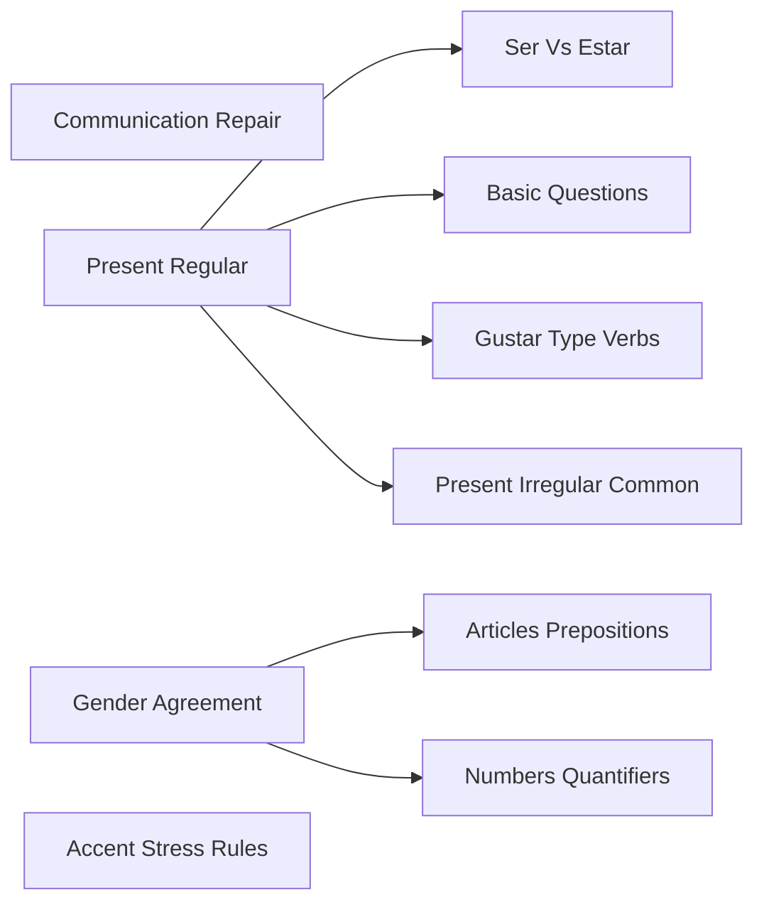
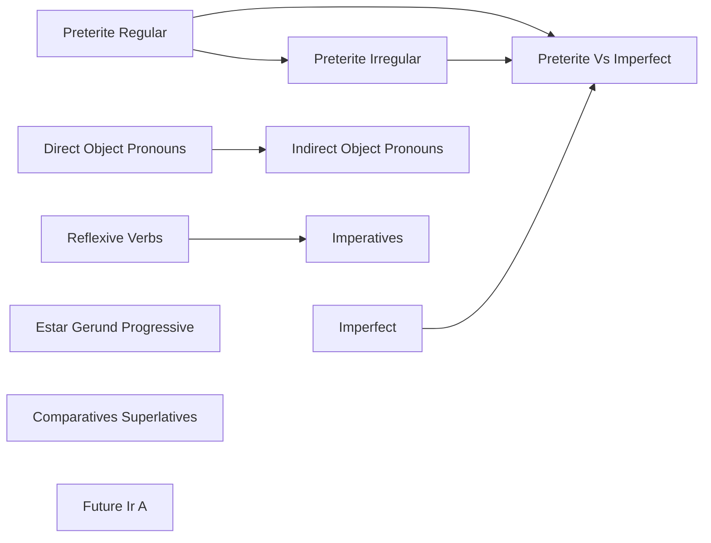
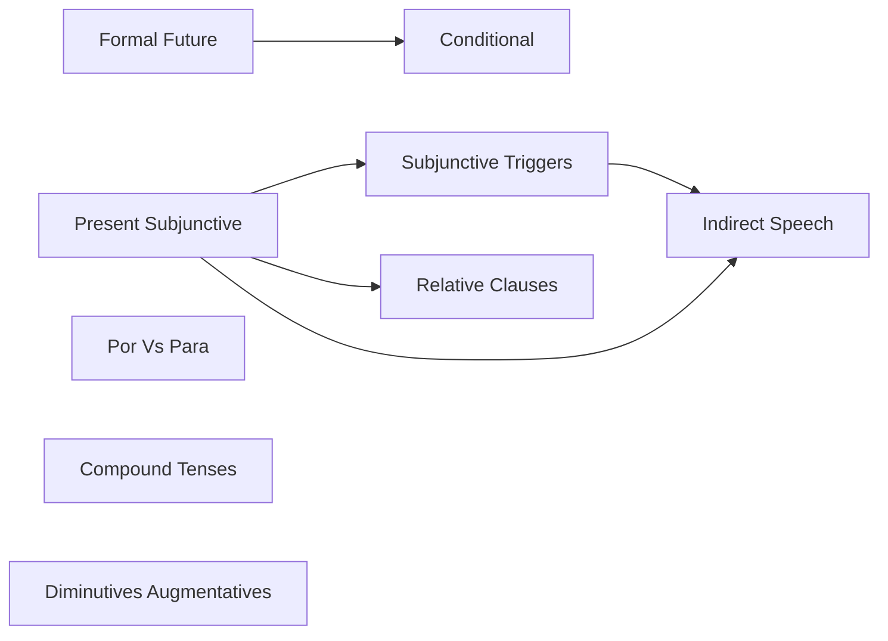
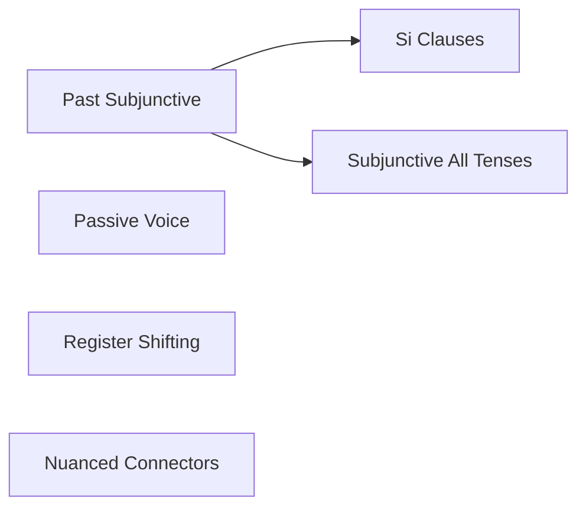

%%Auto-generated from tutor state. Edits will be overwritten.%%

# Roadmap

## Phase A - Foundation
**Progress:** 0/10

- ○ [[Communication Repair]] *(unseen)*
- ○ [[Present Regular]] *(unseen)*
- ○ [[Ser Vs Estar]] *(unseen)*
- ○ [[Gender Agreement]] *(unseen)*
- ○ [[Articles Prepositions]] *(unseen)*
- ○ [[Basic Questions]] *(unseen)*
- ○ [[Gustar Type Verbs]] *(unseen)*
- ○ [[Present Irregular Common]] *(unseen)*
- ○ [[Numbers Quantifiers]] *(unseen)*
- ○ [[Accent Stress Rules]] *(unseen)*

## Phase B - Conversational
**Progress:** 0/11

- ○ [[Preterite Regular]] *(unseen)*
- ○ [[Preterite Irregular]] *(unseen)*
- ○ [[Imperfect]] *(unseen)*
- ○ [[Preterite Vs Imperfect]] *(unseen)*
- ○ [[Reflexive Verbs]] *(unseen)*
- ○ [[Direct Object Pronouns]] *(unseen)*
- ○ [[Indirect Object Pronouns]] *(unseen)*
- ○ [[Estar Gerund Progressive]] *(unseen)*
- ○ [[Imperatives]] *(unseen)*
- ○ [[Comparatives Superlatives]] *(unseen)*
- ○ [[Future Ir A]] *(unseen)*

## Phase C - Intermediate
**Progress:** 0/9

- ○ [[Present Subjunctive]] *(unseen)*
- ○ [[Subjunctive Triggers]] *(unseen)*
- ○ [[Formal Future]] *(unseen)*
- ○ [[Conditional]] *(unseen)*
- ○ [[Por Vs Para]] *(unseen)*
- ○ [[Compound Tenses]] *(unseen)*
- ○ [[Relative Clauses]] *(unseen)*
- ○ [[Indirect Speech]] *(unseen)*
- ○ [[Diminutives Augmentatives]] *(unseen)*

## Phase D - Advanced
**Progress:** 0/6

- ○ [[Past Subjunctive]] *(unseen)*
- ○ [[Si Clauses]] *(unseen)*
- ○ [[Subjunctive All Tenses]] *(unseen)*
- ○ [[Passive Voice]] *(unseen)*
- ○ [[Register Shifting]] *(unseen)*
- ○ [[Nuanced Connectors]] *(unseen)*

## Input Levels

### Listening
L1 (Simplified) → L2 (Slow/Structured) → L3 (Moderate) → L4 (Natural + Subtitles) → L5 (Native Media)

### Reading
R1 (Cognates/Labels) → R2 (Graded Readers L1) → R3 (Graded L2-3) → R4 (Authentic Articles) → R5 (Literature)

**Current:** Listening L1 | Reading R1
